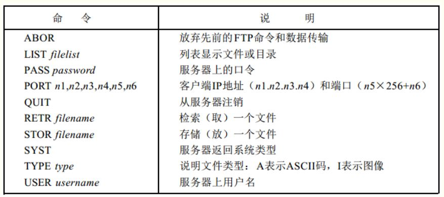
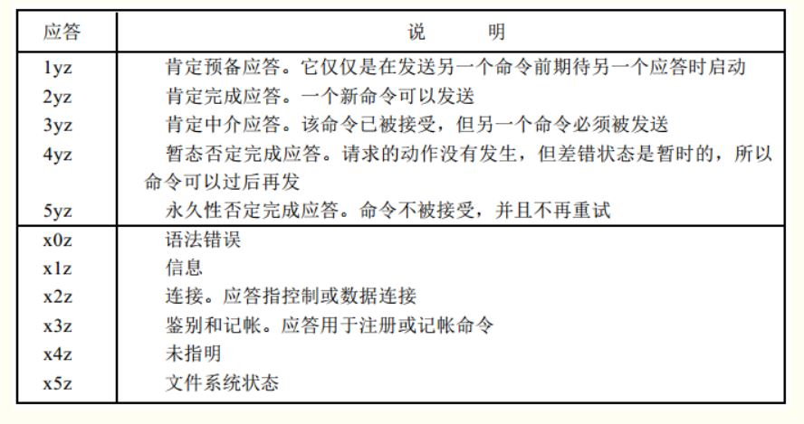
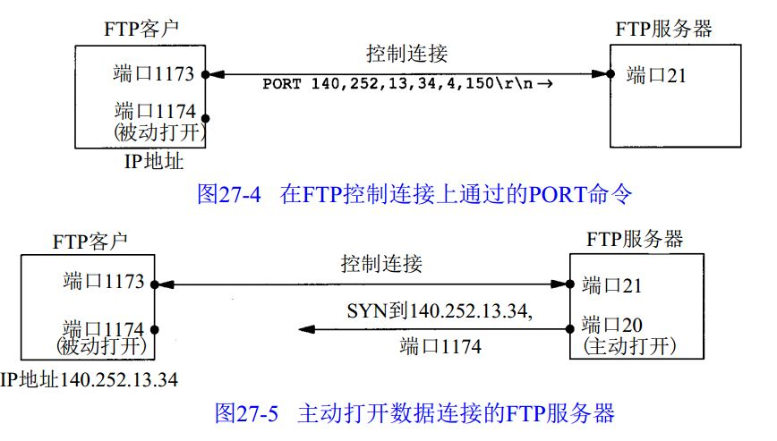

### 一、ftp协议

**1、定义**

​	ftp（file transfer protocol），文件传输协议，用于把一个完整的文件从一个系统传输到另一个系统中。

​	ftp属于应用层协议，它的下一层协议是tcp。

**2、基本工作原理**

​	ftp使用客户端-服务器模型，一个ftp服务器可以为多个客户进程提供服务。ftp服务器主要分为两大部分：一个是主进程，负责接收新的请求（这个也叫控制连接），用于接受客户端的发送命令。还有若干从属进程，负责为每个用户创建一个数据连接，传输数据。

​	ftp是一种交互式的文件传输系统，命令传输在控制连接端进行，数据传输在数据连接端进行。

基本步骤如下：

（1）服务器打开21号端口（ftp连接服务），监听来自客户的连接请求。

（2）客户端随机选择自己的端口，然后连接ftp服务器。连接上就相当于创建了一个控制连接

（3）客户端通过控制连接给服务器发送命令，例如需要什么文件，自己用于数据连接的端口号等等。

（4）客户端选择一个临时端口号，并且通过控制连接，把端口号告知服务器

（5）服务器收到端口号之后，创建一个数据连接，连接客户端的数据端口号，服务器用于数据传输的端口号是20。

（6）然后客户端在控制连接端给服务器发送命令，在数据连接端传输数据。

**3、数据表示**

　FTP协议规定了控制协议传送与存储的多种选择，在以下4个方面必须做出一个选择。

- 文件类型：ASCII码文件(默认的)/ 图像文件类型(二进制的)/ 本地文件类型(用于在具有不同字节大小主机间传送二进制数据)
- 格式控制：该选项针对ASCII类型文件适用，非打印(默认选择，文件中不包含垂直格式信息)/ 远程登录格式控制
- 结构：文件结构(默认选择，文件被认为是一个连续的字节流，不存在内部的文件结构)/ 记录结构(用于文本文件)
- 传输方式：流方式(模式选择，文件以**字节流方式传输**，对于文件结构，**发方在文件尾提示关闭数据连接**，对于记录结构，有专用的两字节序列码记录结束和文件结束)/ 块方式(文件以一系列块来传送，每块前面有一个或多个首部字节)/ 压缩方式

**4、ftp命令和应答**

​	命令和应答在客户和服务器上面的控制连接上，使用**NVT ASCII码**形式进行传输。要求每行结尾都要返回CR、LF对（回车和换行），这些命令都是3或者4个字节的大写ASCII字符，其中一些是带选项参数。从客户端到服务器发送的FTP命令超过30种，下面是常见的几种命令：

​	应答都是以ASCII吗形式的3位数字，并且跟有报文选项。其原因是软件系统需要根据数字代码来决定如何应答，而选项串是面向人工处理的。由于客户通常都要输出数字应答和报文串，一个可交互的用户可以通过阅读报文串（而不必记忆所有数字回答代码的含义）来确定应答的含义。

**5、连接管理**

（1）三大用途

​	从客户向服务器发送一个文件

​	从服务器向客户发送一个文件

​	从服务器向客户发送文件或者目录列表

（2）连接细节

​	传输方式是采用字节流的方式进行传输（这个跟底层的tcp协议是相关的），然后文件的结尾就是断开数据连接的标志。

​	就是说，对于每个文件或者目录列表传输，都需要建立一个全新的数据连接。

其一般过程如下：
	1) 正由于是客户发出命令要求建立数据连接，所以数据连接是在客户的控制下建立的。
	2) 客户通常在客户端主机上为所在数据连接端选择一个临时端口号。客户从该端口发布一个被动的打开。
	3) 客户使用P O RT命令从控制连接上把端口号发向服务器。
4) 服务器在控制连接上接收端口号，并向客户端主机上的端口发布一个主动的打开。服务器的数据连接端一直使用端口 2 0。

